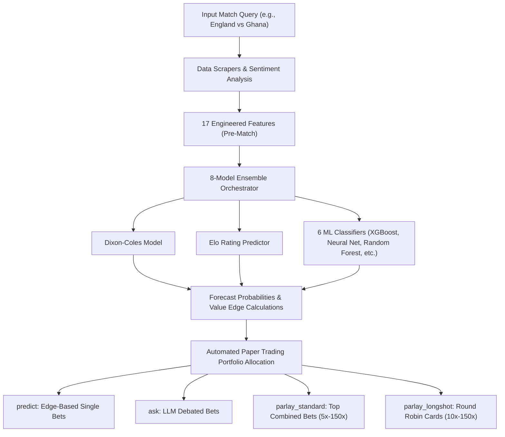
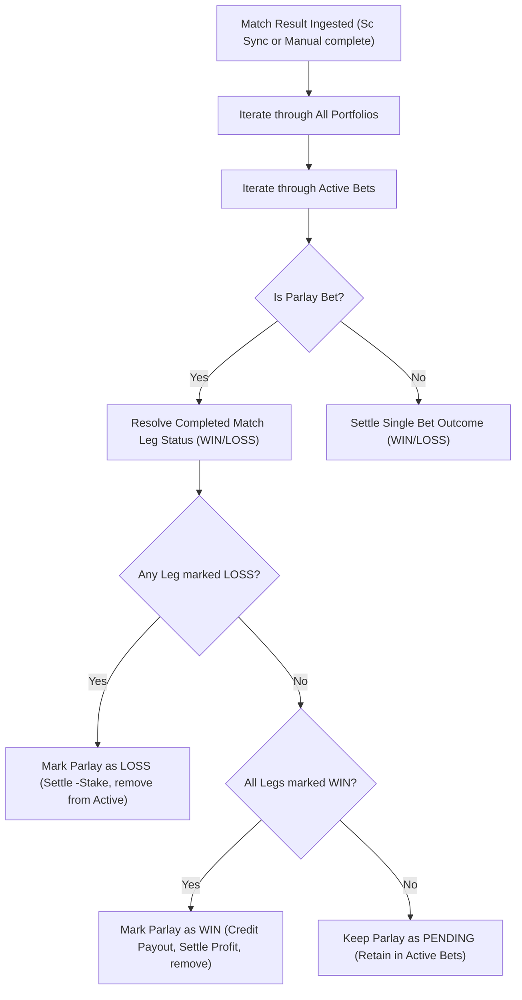

# 🏆 2026 FIFA World Cup Predictor & Parlay Engine ⚽

A unified machine learning and statistical forecasting suite designed specifically for the ongoing **2026 FIFA World Cup**. It combines 8 prediction models (Dixon-Coles score expectations, ELO ratings, and 6 ML classification/regression algorithms) with live news sentiment, Google News RSS, and Kalshi V2 exchange data to identify high-edge betting value and parlay combinations.

It also features a persistent **Multi-Portfolio Paper Trading System** where two rival AI personalities (**Big D**, the old-school qualitative scout, and **SIGMABALLS**, the cold-blooded quant) debate predictions, allocate stakes, and manage their own simulated bankrolls across four separate prediction categories to track which methodology yields the highest return.

---

## 📂 Repository Structure

```text
WorldCupPredictor/
├── data/
│   ├── raw/                   # Raw historical international datasets (2018–2026)
│   ├── processed/             # Master training CSV, ELO ledger, and paper trading state
│   └── models/                # Saved weights/pickles for the 6 ML models
├── src/
│   ├── data/
│   │   ├── scrapers/          # Scrapers (FBRef stats, Google News, ESPN rosters, player_stats)
│   │   └── preprocessor.py    # Feature engineering (17 team/sentiment variables)
│   ├── models/
│   │   ├── base.py            # Unified ML model wrapper interface
│   │   ├── statistical.py     # Dixon-Coles and ELO models
│   │   ├── player_props.py    # Player anytime goals/assists binomial predictor
│   │   └── trainer.py         # ML training algorithms and master dataset appenders
│   ├── market/
│   │   ├── kalshi_client.py   # Kalshi V2 API authenticated portfolio client
│   │   ├── paper_trading.py   # Fake bankroll manager and completed match resolver
│   │   └── llm.py             # Prompt constructor and model mappings for AI debates
│   ├── parlay/
│   │   └── parlay_engine.py   # Correlated same-game scoreline joint probabilities
│   └── predictor.py           # Core orchestrator blending the 8 forecasting models
├── main.py                    # Main CLI Entrypoint
├── show_project_summary.py    # Interactive dashboard printing project stats
├── requirements.txt           # Required Python packages
├── scratch/
│   ├── test_bot_betting.py    # Bot betting candidates unit tests
│   ├── test_player_scraping.py# Scraper mock testing
│   ├── test_prop_math.py      # Player prop binomial prediction tests
│   ├── test_player_prop_resolution.py # Completed match prop resolver tests
│   └── test_player_props_integration.py # E2E CLI pipeline integration tests
└── .env                       # Environment credentials and configurations
```

---

## 📊 System Architecture

### 1. Forecasting & Capital Allocation Flow


### 2. Parlay Leg Resolution Pipeline


---

## 💼 Paper Trading Portfolios
To evaluate which method performs best, the AI personalities (**Big D** and **SIGMABALLS**) maintain isolated bankrolls of **$1,000.00** each across four distinct portfolios:

1. **`predict` (Match Forecasts):** Automated bets placed when you query a match. 
   - **Big D** places a gut bet (10% of bankroll) on the moneyline of the team with the highest model probability.
   - **SIGMABALLS** scans all moneyline and game line edges and places a calculated bet (5% of bankroll) on the option with the highest positive edge.
2. **`ask` (Debates & LLM Plays):** Capital allocated dynamically during the scout-quant LLM debates. If live odds change, the bots can choose to stick with or hedge/update their positions, triggering automatic stake refunds.
3. **`parlay_standard` (Standard Parlays):** Both bots place bets on the top recommended standard or today-only parlay. (Big D: 10% stake, SIGMABALLS: 5% stake).
4. **`parlay_longshot` (Longshot Round Robins):** The bots split their capital across all 5 generated round-robin cards. (Big D: 2% per card, SIGMABALLS: 1% per card).

---

## 🛠️ Configuration & Credentials

Create a `.env` file in the root of the repository:

```env
# Kalshi V2 API RSA Credentials (Read-Only)
KALSHI_API_KEY_ID=your-kalshi-api-key-uuid
KALSHI_PRIVATE_KEY_PATH=C:/path/to/your/private_key.txt

# Google Generative AI / Gemini API Credentials
GEMINI_API_KEY=your-gemini-api-key
GEMINI_MODEL=gemini-1.5-flash
```

---

## 💻 CLI Commands Reference

All orchestration is managed via [main.py](file:///C:/Users/Bikash/Desktop/CODEBASE/WorldCupPredictor/main.py). The available commands are:

### 1. `init` - Initial Model Training
Trains the 6 machine learning models on the master historical match records dataset.
```bash
python main.py init
```

### 2. `update` - Scoreboard Auto-Sync & Retraining
Fetches completed World Cup matches from ESPN. It updates ELOs, resolves active paper trades across all portfolios, appends new rows to the training set, and retrains all models.
```bash
python main.py update
```

### 3. `predict` - Match Forecast & Betting Edge
Blends ELO ratings, news sentiment, and all 8 models to output the forecast probabilities for Home Win, Draw, and Away Win. It also automatically places paper bets in the `predict` portfolio and outputs value edges against live Kalshi prices.
```bash
python main.py predict "England vs Ghana"
```

### 4. `ask` - Personality Debates & Paper Bets
Stages an LLM debate between **Big D** and **SIGMABALLS** analyzing the game. They place their paper bets in the `ask` portfolio. The command checks for odds changes, displays position comparison alerts, and manages stake refunds.
```bash
# Uses the default model specified in .env
python main.py ask "England vs Ghana"
```

### 5. `parlay` - Correlated Kalshi Combo Builder
Searches live Kalshi markets to construct 3-to-5-leg parlay/combo recommendations with a combined payout $\ge 5x$.
- `-t`, `--today`: Generate parlays/combos playing today only, sorted by **highest joint probability (success ratio)**. It converts UTC to local timezone and handles late-night slate rollovers.
- `-l`, `--longshot`: Generate a portfolio of high-payout long-shot parlays (10x to 150x payout) sorted by expected edge.
```bash
# Standard parlays (Automatically bets in parlay_standard portfolio)
python main.py parlay -t

# Risky but high-value long-shot Round Robin portfolio (Automatically bets in parlay_longshot portfolio)
python main.py parlay -l
```

### 6. `complete` - Manual Match Resolution
Manually ingests a completed game score. It updates team ELOs, resolves active paper bets across all portfolios, and triggers model retraining.
```bash
python main.py complete england ghana 2 1
```

### 7. `portfolio` - Kalshi Account Summary
Connects to the live Kalshi elections endpoint (`https://api.elections.kalshi.com`) to print your live cash balance and closed trades history.
```bash
python main.py portfolio
```

---

## ⚽ Player Stats & Props Predictions

The predictor features a complete pipeline for scraping starting lineups, blending player statistics, calculating anytime goals/assists binomial distributions, matching props to live Kalshi contracts, and resolving them automatically.

### 1. Dynamic Starting Lineups Scraper
- **ESPN Lineups Feed**: Automatically parses the starting lineups for the match.
- **Recent Completed Game Fallback**: If the official starting lineups are not yet published for an upcoming match (e.g. earlier than 30 minutes before kickoff), the scraper automatically looks back through each country's previous completed matches (up to 8 days prior) to extract their most recent starting 11 roster.
- **Default Squads Backup**: If no recent completed matches are found on ESPN, the system falls back to a curated roster seed containing each country's primary tournament squad.

### 2. Tiered SQLite Caching & Storage
To optimize performance and comply with API rate limits:
- **General cache table**: Stores raw ESPN scoreboard JSON (6h TTL) and parsed event lineups (24h TTL).
- **`player_statistics` table**: Persists scraped player stats from FBRef (Goals, Assists, Minutes played, Expected Goals xG, Position) with a 7-day TTL cache.
- **Overhead Optimization**: Checks database initialization status locally on connection to avoid executing duplicate DDL (`CREATE TABLE IF NOT EXISTS`) statements on every query.

### 3. Binomial Goal & Assist Prediction Math
For every player in the starting lineups:
- **Prior Blending**: Blends the player's club/country statistics (60% country stats weight, 40% club stats weight) or uses position-specific default profiles (e.g., forwards: 0.25 G/90, midfielders: 0.15 A/90) if no club data is scraped.
- **Binomial Matrix Integration**: Conditional binomial probability distribution calculates the odds of the player scoring or assisting given the Dixon-Coles match-level scoreline expectation joint matrix:
  $$P(\text{at least } k \text{ events}) = \sum_{g=k}^{6} P(\text{Team Goals} = g) \times \sum_{j=k}^{g} \binom{g}{j} s^j (1 - s)^{g - j}$$
  where $s$ is the player's share of team goalscoring/assisting per 90.
- **Categories Predicted**:
  - **Player Goals**: `1+ Goals`, `2+ Goals`
  - **Player Assists**: `1+ Assists`, `2+ Assists`
  - **Player G/A**: `Score or Assist` (any goal or assist contribution)

### 4. Word-Boundary Regex Market Matching
- Matches predicted player prop statistics against live Kalshi contracts using case-insensitive pre-compiled regex matching with clear word boundaries:
  `r'(?<!\w)' + re.escape(player_name) + r'(?!\w)'`
- This ensures full-word matching and completely avoids substring collision bugs (such as matching "Ed" inside "Edward").

### 5. Automated Completed Match Props Settlement
- **Match Ingestion**: During `complete` or `update` commands, the resolver queries the completed match summary page on ESPN.
- **Boxscore Rosters**: Extracts the actual goals and assists stats for each player in that specific match to settle player prop bets (WIN/LOSS) and update bot bankrolls accordingly.

---

## 🧠 Advanced Model & Algorithm Refinements

To maximize forecasting accuracy, the orchestrator incorporates advanced statistical and machine learning modeling techniques:

### 1. Time-Decayed Dixon-Coles Regressor
- **Dynamic Weighting**: Incorporates an exponential time-decay parameter ($\xi = 0.0019$, equivalent to a half-life of ~365 days) that discounts older matches relative to the match forecast date:
  $$\phi(t) = \exp(-\xi t)$$
- **NumPy Vectorized Likelihood Optimization**: Runs purely in vectorized arrays to bypass slow loop iteration. This reduces SciPy L-BFGS-B parameter fitting time on 10,000+ matches from ~42 minutes to **under 3.5 seconds**, utilizing cached results in SQLite.
- **Numerical Stability**: Re-formulates maximum likelihood estimation directly in log-probability space, utilizing `np.clip` on scoring intensities to completely prevent numeric overflow or underflow under SciPy optimization.
- **Robust Fallbacks**: Automatically falls back to safe prior parameters if a team has insufficient history or if the optimizer fails to converge.

### 2. Advanced Elo Rating System
- **Stage-Dependent K-factors**: Scales match importance based on the official FIFA/eloratings.net weights (e.g., friendly matches = 20 weight, World Cup qualifiers = 40 weight, World Cup knockout matches = 60 weight).
- **Margin of Victory Multiplier**: Updates ratings using a goal-difference scaling factor:
  $$R_{\text{new}} = R_{\text{old}} + K \times M(N) \times (W - W_e)$$
  where $M(N) = 1.75 + \frac{N-3}{8}$ for absolute goal differences $N \ge 4$.
- **Regional Home Advantage**: Dynamically applies a +100 ELO home advantage boost for non-neutral fixtures, defaulting to 0 for neutral tournament grounds.

### 3. Rest Days, Fatigue Index, and Travel Distance Preprocessing
- **Haversine Distance**: Calculates exact travel distances in kilometers between match venues using the Haversine formula, clipping values to avoid math domain exceptions.
- **Fatigue Tracking**: Computes rest days ($\Delta t_{\text{rest}}$) between consecutive fixtures and marks an **Extreme Fatigue** indicator if a team recovery window is $\le 3$ days.
- **SQLite Travel Log**: Persists coordinates and travel histories using a composite key `PRIMARY KEY (team, date)` to query travel states chronologically.

### 4. Two-Stage Stacking Classifier Ensemble & Staking
- **Stage 1 Base Learners**: Combines predictions from an XGBoost classifier, a LightGBM classifier, and a Multi-Layer Perceptron (MLP) Neural Network.
- **Stage 2 Meta-Learner**: Fits a Ridge Logistic Regression classifier using standard scaling on the concatenated out-of-fold predicted probabilities, preventing data leakage and stabilizing outputs.
- **Fractional Kelly Sizing**: Integrates a Quarter-Kelly Criterion bankroll allocation for quant paper-bets (`SIGMABALLS`):
  $$f^* = 0.25 \times \frac{p \times b - (1 - p)}{b}$$
  where $b = \text{odds} - 1$ and $p = \text{probability}$. Capped at 15% maximum allocation to manage drawdown volatility.
- **Enforced Real AI Debates**: Disables simulated fallbacks. The CLI exits with a clean alert if `GEMINI_API_KEY` is missing to ensure only live models drive bot decisions.

---

## 📈 Real-Time Tournament Self-Learning

The system dynamically adapts to the progression of the tournament and continuously updates its parameters as games are played.

### 1. Dynamic Tournament Stage Detection
- **Date-Based Progression**: The engine automatically detects the tournament phase. Starting June 28, 2026, the stage changes to **Knockout Stage (Single Elimination)**.
- **Debate Prompt Context**: Informs the scout and quant AI personalities (**Big D** and **SIGMABALLS**) during LLM debates that matches are in single elimination, but explicitly highlights that Kalshi moneyline markets still resolve based on the scoreline at the end of regulation (90 mins + injury time).

### 2. Rolling Team Averages from Completed Matches
- **Decoupled from Static Priors**: Rather than relying on pre-tournament static team stats, the Dixon-Coles goal expectation parameters (`avg_goals`, `avg_conceded`) and form indexes are computed dynamically from `master_dataset.csv`.
- **Tournament Form**: The scraper uses the last 10 games involving the team to update their offensive and defensive baselines, ensuring the model ensemble adapts to their current tournament form.

### 3. Decaying/Boosting Player Form Updates
- **Feedback Loop**: When a completed match is resolved (`complete` or `update`), the starting players' statistics are updated in the SQLite `player_statistics` table.
- **Rolling Math**: Adjusts player expectations (Goals, Assists, xG) using a rolling average formula:
  $$\text{New Stat} = \frac{\text{Old Stat} \times 10 + \text{Match Performance}}{11}$$
  - **Boost**: Players who score or assist receive an expectation boost.
  - **Decay**: Players who do not score or assist have their expectations decay naturally.

---

## 📊 Summary Dashboard
Run [show_project_summary.py](file:///C:/Users/Bikash/Desktop/CODEBASE/WorldCupPredictor/show_project_summary.py) at any time to print a clean console view of dataset sizes, top ELO ratings, and bankroll standings across all four portfolios:
```bash
python show_project_summary.py
```
