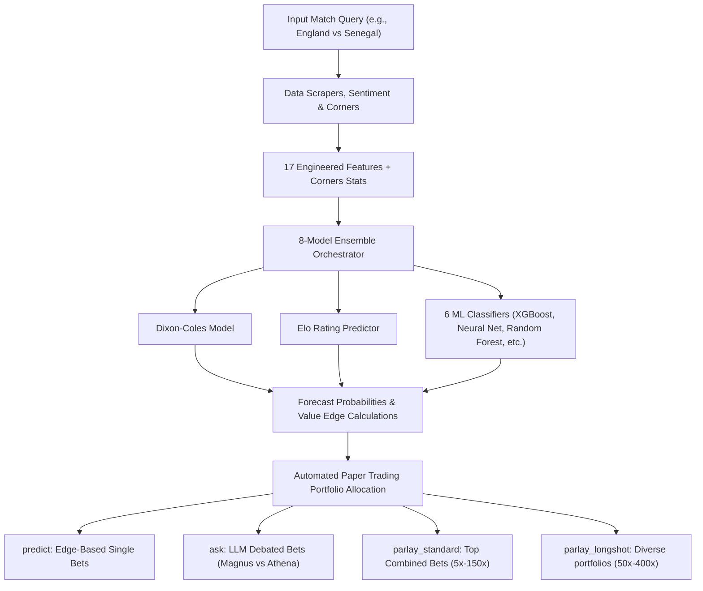
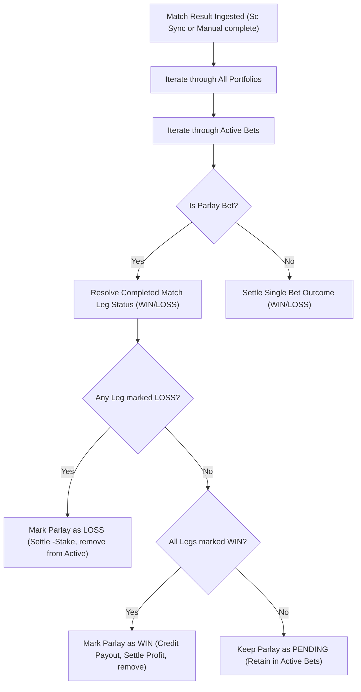

# 🏆 2026 FIFA World Cup Predictor & Parlay Engine ⚽

A unified machine learning and statistical forecasting suite designed specifically for the ongoing **2026 FIFA World Cup**. It combines 8 prediction models (Dixon-Coles score expectations, ELO ratings, and 6 ML classification/regression algorithms) with live news sentiment, Google News RSS, ESPN corner statistics, and Kalshi V2 exchange data to identify high-edge betting value and parlay combinations.

It also features a persistent **Multi-Portfolio Paper Trading System** where two rival AI personalities (**Magnus**, the old-school qualitative scout, and **Athena**, the cold-blooded quant) debate predictions, allocate stakes, and manage their own simulated bankrolls across four separate prediction categories to track which methodology yields the highest return.

---

## 📂 Repository Structure

```text
WorldCupPredictor/
├── data/
│   ├── raw/                   # Raw historical international datasets (2018–2026)
│   ├── processed/             # Master training CSV, ELO ledger, and paper trading state
│   └── models/                # Saved weights/pickles for the 6 ML models
├── src/
│   ├── data/
│   │   ├── scrapers/          # Scrapers (FBRef stats, ESPN rosters, corners, upcoming_and_stats)
│   │   └── preprocessor.py    # Feature engineering (17 team/sentiment variables)
│   ├── models/
│   │   ├── base.py            # Unified ML model wrapper interface
│   │   ├── statistical.py     # Dixon-Coles and ELO models
│   │   ├── player_props.py    # Player anytime goals/assists binomial predictor
│   │   └── trainer.py         # ML training algorithms and master dataset appenders
│   ├── market/
│   │   ├── kalshi_client.py   # Kalshi V2 API authenticated portfolio client
│   │   ├── paper_trading.py   # Fake bankroll manager and completed match resolver
│   │   └── llm.py             # Prompt constructor and model mappings for AI debates
│   ├── parlay/
│   │   └── parlay_engine.py   # Correlated same-game scoreline joint probabilities
│   └── predictor.py           # Core orchestrator blending the 8 forecasting models
├── main.py                    # Main CLI Entrypoint
├── show_project_summary.py    # Interactive dashboard printing project stats
├── requirements.txt           # Required Python packages
├── scratch/
│   ├── test_corners.py        # ESPN corners scraper tests
│   ├── test_stats_ingestion.py# Upcoming fixtures and tournament stats scraper tests
│   ├── test_longshot_portfolio.py # Diverse parlay portfolio math tests
│   ├── test_run_daily.py      # Daily execution pipeline runner tests
│   └── test_integration.py    # E2E CLI pipeline integration tests
└── .env                       # Environment credentials and configurations
```

---

## 📊 System Architecture

### 1. Forecasting & Capital Allocation Flow


### 2. Parlay Leg Resolution Pipeline


---

## 💼 Paper Trading Portfolios
To evaluate which method performs best, the AI personalities (**Magnus** and **Athena**) maintain isolated bankrolls of **$1,000.00** each across four distinct portfolios:

1. **`predict` (Match Forecasts):** Automated bets placed when you query a match. 
   - **Magnus** places a gut bet (10% of bankroll) on the moneyline of the team with the highest model probability.
   - **Athena** scans all moneyline and game line edges and places a calculated bet (5% of bankroll) on the option with the highest positive edge.
2. **`ask` (Debates & LLM Plays):** Capital allocated dynamically during the scout-quant LLM debates. If live odds change, the bots can choose to stick with or hedge/update their positions, triggering automatic stake refunds.
3. **`parlay_standard` (Standard Parlays):** Both bots place bets on the top recommended standard or today-only parlay. (Magnus: 10% stake, Athena: 5% stake).
4. **`parlay_longshot` (Longshot portfolios):** The bots allocate a flat **$2.00** stake per card across all 10 generated round-robin cards (Magnus: $2.00 flat, Athena: $2.00 flat).

---

## 🛠️ Configuration & Credentials

Create a `.env` file in the root of the repository:

```env
# Kalshi V2 API RSA Credentials (Read-Only)
KALSHI_API_KEY_ID=your-kalshi-api-key-uuid
KALSHI_PRIVATE_KEY_PATH=C:/path/to/your/private_key.txt

# Google Generative AI / Gemini API Credentials
GEMINI_API_KEY=your-gemini-api-key
GEMINI_MODEL=gemini-1.5-flash
```

---

## 💻 CLI Commands Reference

All orchestration is managed via [main.py](file:///C:/Users/Bikash/Desktop/CODEBASE/WorldCupPredictor/main.py). The available commands are:

### 1. `init` - Initial Model Training
Trains the 6 machine learning models on the master historical match records dataset.
```bash
python main.py init
```

### 2. `update` - Scoreboard Auto-Sync & Ingestion
Fetches completed tournament match results from ESPN scoreboard, updates ELOs, resolves active paper trades, and retrains all models. It also parses:
- Upcoming fixtures scheduled for today and the next 2 days $\rightarrow$ writes to `data/processed/daily_schedule.json`.
- Live tournament statistics (top goals and assists leaders) $\rightarrow$ writes to `data/processed/tournament_player_stats.json`.
```bash
python main.py update
```

### 3. `run-daily` - Daily Betting Pipeline Runner
Reads the prepared `daily_schedule.json`, filters for games scheduled for the current UTC date, and sequentially executes the forecasting pipeline (`predict` + `ask` debate + standard/longshot parlay portfolios placement) automatically.
```bash
python main.py run-daily
```

### 4. `predict` - Match Forecast & Corner Expectations
Blends ELO ratings, news sentiment, and all 8 models to output the forecast probabilities for Home Win, Draw, and Away Win, prints expected corners won/conceded, and places paper bets in the `predict` portfolio.
```bash
python main.py predict "England vs Senegal"
```

### 5. `ask` - Personality Debates & Paper Bets
Stages an LLM debate between **Magnus** and **Athena** analyzing the game, including corners and knockout qualification, placing paper bets in the `ask` portfolio.
```bash
python main.py ask "England vs Senegal"
```

### 6. `parlay` - Correlated Kalshi Combo Builder
Searches live Kalshi markets to construct parlay/combo recommendations.
- `-t`, `--today`: Generate parlays/combos playing today only, sorted by highest joint probability.
- `-l`, `--longshot`: Generate a hedged portfolio of **10 distinct cards** targeting **50x to 400x** payout longshots, keeping overlap under 3 legs.
```bash
# Standard parlays
python main.py parlay -t

# Long-shot portfolios (flat $2.00 stakes per card)
python main.py parlay -l
```

---

## ⚽ Player Stats & Props Predictions

The predictor features a complete pipeline for scraping starting lineups, blending player statistics, calculating anytime goals/assists binomial distributions, matching props to live Kalshi contracts, and resolving them automatically.

### 1. Tournament Statistics Blending
- **Prior Blending**: Blends the player's club/country statistics (60% country stats weight, 40% club stats weight) or uses position-specific default profiles.
- **World Cup Form Boost**: Blends the player's historical stats 50/50 with their current World Cup performance (World Cup goals divided by their team's completed tournament match count).
- **Binomial Matrix Integration**: Conditional binomial probability distribution calculates the odds of the player scoring or assisting given the Dixon-Coles match-level scoreline expectation joint matrix:
  $$P(\text{at least } k \text{ events}) = \sum_{g=k}^{6} P(\text{Team Goals} = g) \times \sum_{j=k}^{g} \binom{g}{j} s^j (1 - s)^{g - j}$$
  where $s$ is the player's share of team goalscoring/assisting per 90.

---

## 🧠 Advanced Model & Algorithm Refinements

### 1. ESPN Corners & Poisson CDF modeling
- **Rolling Scraper**: Scrapes up to 5 of the team's most recent completed World Cup matches to calculate rolling corners won and conceded averages.
- **Corners Expectation**: Evaluates corner kick scoring intensities $\lambda_{\text{Home}}$ and $\lambda_{\text{Away}}$ based on rolling averages and a tournament baseline factor.
- **Poisson Probabilities**: Models total corners using a Poisson distribution and calculates precise probabilities for over/under lines (e.g. Over 7.5, 8.5, and 9.5 corners) using the Poisson CDF.

### 2. Knockout Progression (To Qualify)
- **Advancement Forecasts**: Estimates advancement probabilities during single-elimination knockout matches, incorporating goalie shootout saving rates (e.g., Alisson: 33%, Pickford: 28%).
- **Same-Game Parlay Correlation**: Implements SGP joint probability math. If a team wins in regulation, their advancement probability is $1.0$. If a team draws, the conditional probability of qualifying is:
  $$P(\text{Qualify} \mid \text{Draw}) = \frac{P(\text{Qualify}) - P(\text{Regulation Win})}{P(\text{Draw})}$$

### 3. Diverse Parlay portfolios (Round Robin Hedging)
- **Shared Leg Filtering**: Sorts candidates by edge descending, and greedily compiles a 10-card portfolio.
- **Diversity Rules**: To prevent combinatorial overlap, a parlay is only added if it shares **at most 2 legs** with any already-selected parlay in the portfolio.
- **Description Collisions**: Avoids key collisions by appending match titles to generic outcome descriptions (e.g., `"Moneyline: Draw (France vs Sweden)"`).

### 4. Same-Game Parlay (SGP) Sandbox Validator
- **Programmatic SGP Rules**: Enforces Kalshi SGP rules programmatically via `SgpSandboxValidator` in [sgp_validator.py](file:///C:/Users/Bikash/Desktop/CODEBASE/WorldCupPredictor/src/parlay/sgp_validator.py) before recommending or placing combos.
- **Mutually Exclusive/Redundant Discards**:
  - **BTTS & Over 1.5 Goals**: Blocked (BTTS YES guarantees 2+ goals, making Over 1.5 redundant).
  - **Moneyline & To Advance**: Blocked (regulation win implies qualifying).
  - **Spread & Moneyline**: Blocked (beating spread implies winning).
  - **Player Goal & Team Goals (Over 0.5)**: Blocked (player scoring implies team scores 1+ goals).
  - **Multi-Selection Caps**: Disallows more than 1 Moneyline leg, 1 Spread leg, or 1 Totals leg per match.

### 5. Knockout SGP Leg Expansion
- **Corners & To Advance Integration**: Automatically queries and parses `KXWCQUAL` (To Advance) and `KXWCTCORNERS` (Total Corners) tickers from Kalshi, enabling rich 5-leg to 8-leg parlays per match even when the daily slate has only 1 or 2 games.

---

## 🚀 Future Roadmap (Phase 4)
Based on comparative research of sports analytics and prediction agents (such as `Hicruben` and `AhmedHazem02`), the following features are actively under development:
1. **Active News Debating Agents**: Equipping Magnus and Athena with active web-search agents to debate real-time squad roster changes, squad injuries, and news before trades.
2. **Tournament Monte Carlo Simulation Dashboard**: A visual dashboard running 10,000 Monte Carlo runs of the remaining knockout bracket to plot visual progression trees and path-dependent team probabilities.

