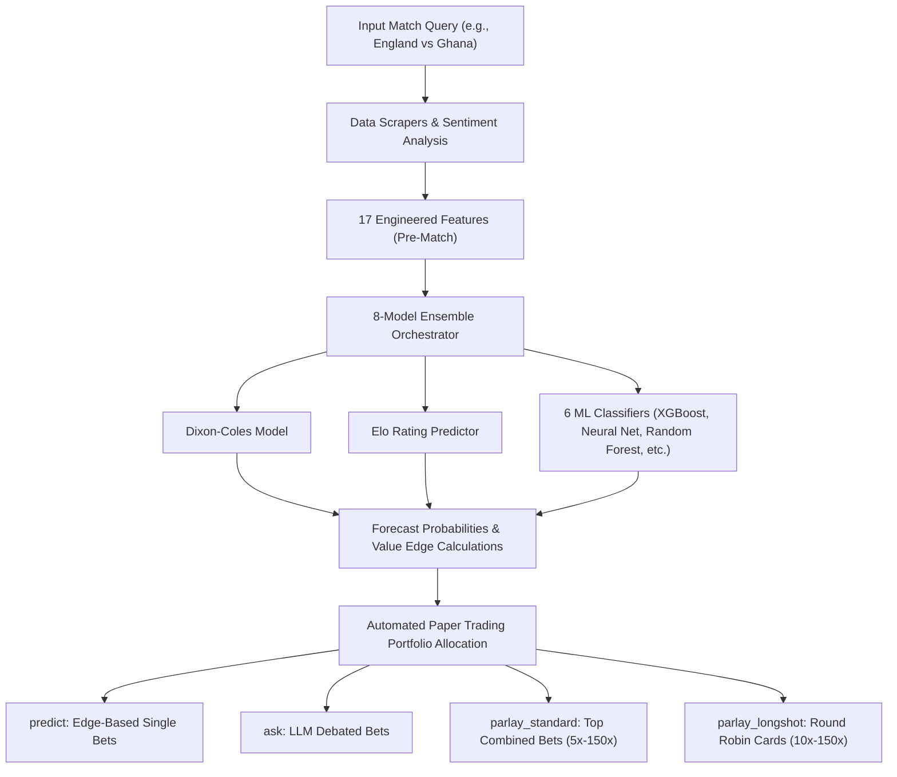
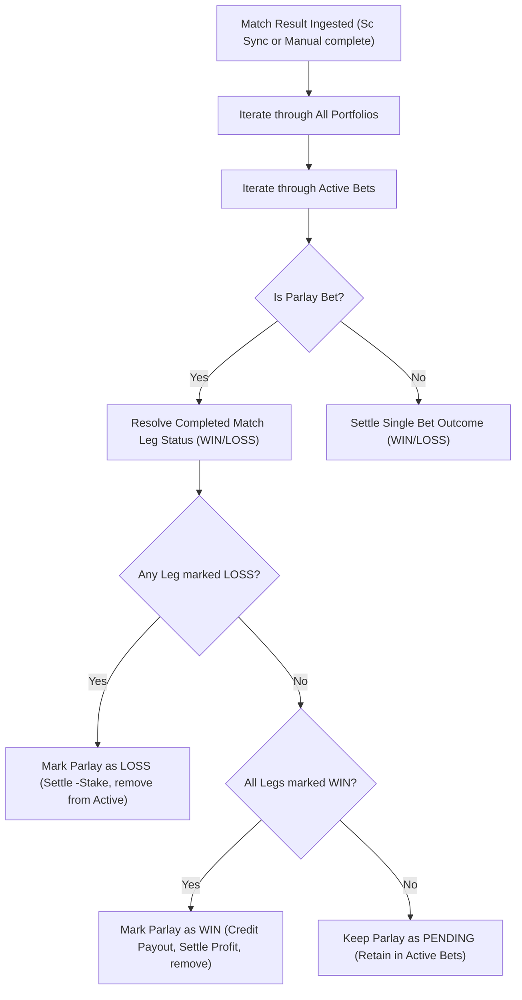

# 🏆 2026 FIFA World Cup Predictor & Parlay Engine ⚽

A unified machine learning and statistical forecasting suite designed specifically for the ongoing **2026 FIFA World Cup**. It combines 8 prediction models (Dixon-Coles score expectations, ELO ratings, and 6 ML classification/regression algorithms) with live news sentiment, Google News RSS, and Kalshi V2 exchange data to identify high-edge betting value and parlay combinations.

It also features a persistent **Multi-Portfolio Paper Trading System** where two rival AI personalities (**Big D**, the old-school qualitative scout, and **SIGMABALLS**, the cold-blooded quant) debate predictions, allocate stakes, and manage their own simulated bankrolls across four separate prediction categories to track which methodology yields the highest return.

---

## 📂 Repository Structure

```text
WorldCupPredictor/
├── data/
│   ├── raw/                   # Raw historical international datasets (2018–2026)
│   ├── processed/             # Master training CSV, ELO ledger, and paper trading state
│   └── models/                # Saved weights/pickles for the 6 ML models
├── src/
│   ├── data/
│   │   ├── scrapers/          # Scrapers (FBRef stats, Google News sentiment, ESPN fixtures)
│   │   └── preprocessor.py    # Feature engineering (17 team/sentiment variables)
│   ├── models/
│   │   ├── base.py            # Unified ML model wrapper interface
│   │   ├── statistical.py     # Dixon-Coles and ELO models
│   │   └── trainer.py         # ML training algorithms and master dataset appenders
│   ├── market/
│   │   ├── kalshi_client.py   # Kalshi V2 API authenticated portfolio client
│   │   ├── paper_trading.py   # Fake bankroll manager and bet resolution engine
│   │   └── llm.py             # Prompt constructor and model mappings for AI debates
│   ├── parlay/
│   │   └── parlay_engine.py   # Correlated same-game scoreline joint probabilities
│   └── predictor.py           # Core orchestrator blending the 8 forecasting models
├── main.py                    # Main CLI Entrypoint
├── show_project_summary.py    # Interactive dashboard printing project stats
├── requirements.txt           # Required Python packages
└── .env                       # Environment credentials and configurations
```

---

## 📊 System Architecture

### 1. Forecasting & Capital Allocation Flow


### 2. Parlay Leg Resolution Pipeline


---

## 💼 Paper Trading Portfolios
To evaluate which method performs best, the AI personalities (**Big D** and **SIGMABALLS**) maintain isolated bankrolls of **$1,000.00** each across four distinct portfolios:

1. **`predict` (Match Forecasts):** Automated bets placed when you query a match. 
   - **Big D** places a gut bet (10% of bankroll) on the moneyline of the team with the highest model probability.
   - **SIGMABALLS** scans all moneyline and game line edges and places a calculated bet (5% of bankroll) on the option with the highest positive edge.
2. **`ask` (Debates & LLM Plays):** Capital allocated dynamically during the scout-quant LLM debates. If live odds change, the bots can choose to stick with or hedge/update their positions, triggering automatic stake refunds.
3. **`parlay_standard` (Standard Parlays):** Both bots place bets on the top recommended standard or today-only parlay. (Big D: 10% stake, SIGMABALLS: 5% stake).
4. **`parlay_longshot` (Longshot Round Robins):** The bots split their capital across all 5 generated round-robin cards. (Big D: 2% per card, SIGMABALLS: 1% per card).

---

## 🛠️ Configuration & Credentials

Create a `.env` file in the root of the repository:

```env
# Kalshi V2 API RSA Credentials (Read-Only)
KALSHI_API_KEY_ID=your-kalshi-api-key-uuid
KALSHI_PRIVATE_KEY_PATH=C:/path/to/your/private_key.txt

# Google Generative AI / Gemini API Credentials
GEMINI_API_KEY=your-gemini-api-key
GEMINI_MODEL=gemini-1.5-flash
```

---

## 💻 CLI Commands Reference

All orchestration is managed via [main.py](file:///C:/Users/Bikash/Desktop/CODEBASE/WorldCupPredictor/main.py). The available commands are:

### 1. `init` - Initial Model Training
Trains the 6 machine learning models on the master historical match records dataset.
```bash
python main.py init
```

### 2. `update` - Scoreboard Auto-Sync & Retraining
Fetches completed World Cup matches from ESPN. It updates ELOs, resolves active paper trades across all four portfolios, appends new rows to the training set, and retrains all models.
```bash
python main.py update
```

### 3. `predict` - Match Forecast & Betting Edge
Blends ELO ratings, news sentiment, and all 8 models to output the forecast probabilities for Home Win, Draw, and Away Win. It also automatically places paper bets in the `predict` portfolio and outputs value edges against live Kalshi prices.
```bash
python main.py predict "England vs Ghana"
```

### 4. `ask` - Personality Debates & Paper Bets
Stages an LLM debate between **Big D** and **SIGMABALLS** analyzing the game. They place their paper bets in the `ask` portfolio. The command checks for odds changes, displays position comparison alerts, and manages stake refunds.
```bash
# Uses the default model specified in .env
python main.py ask "England vs Ghana"
```

### 5. `parlay` - Correlated Kalshi Combo Builder
Searches live Kalshi markets to construct 3-to-5-leg parlay/combo recommendations with a combined payout $\ge 5x$.
- `-t`, `--today`: Generate parlays/combos playing today only, sorted by **highest joint probability (success ratio)**. It converts UTC to local timezone and handles late-night slate rollovers.
- `-l`, `--longshot`: Generate a portfolio of high-payout long-shot parlays (10x to 150x payout) sorted by expected edge.
```bash
# Standard parlays (Automatically bets in parlay_standard portfolio)
python main.py parlay -t

# Risky but high-value long-shot Round Robin portfolio (Automatically bets in parlay_longshot portfolio)
python main.py parlay -l
```

### 6. `complete` - Manual Match Resolution
Manually ingests a completed game score. It updates team ELOs, resolves active paper bets across all portfolios, and triggers model retraining.
```bash
python main.py complete england ghana 2 1
```

### 7. `portfolio` - Kalshi Account Summary
Connects to the live Kalshi elections endpoint (`https://api.elections.kalshi.com`) to print your live cash balance and closed trades history.
```bash
python main.py portfolio
```

---

## 📊 Summary Dashboard
Run [show_project_summary.py](file:///C:/Users/Bikash/Desktop/CODEBASE/WorldCupPredictor/show_project_summary.py) at any time to print a clean console view of dataset sizes, top ELO ratings, and bankroll standings across all four portfolios:
```bash
python show_project_summary.py
```
