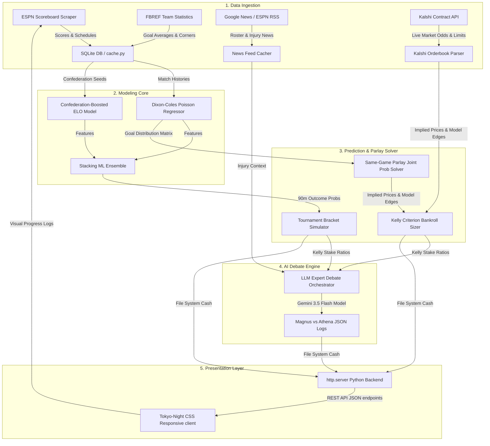

# 🏆 World Cup Predictor & Kalshi Parlay Engine
## Software Engineering Systems Architecture Manual
*Author: Principal Systems Architect*

---

## 1. System Topology & Data Flow Diagram

The project is structured as a pipeline that flows from raw data scraper feeds up to a Tokyo-Night glassmorphism visual client. The engine bridges live market odds, mathematical sports prediction modeling, and LLM-driven qualitative analysis.



---

## 2. Statistical Sports Analytics Core

### Dixon-Coles Bivariate Goal Regressor
Standard Poisson goal models assume the goals scored by the home team ($X$) and away team ($Y$) are completely independent. However, football exhibits scoring dependencies—most notably a higher probability of low-scoring draws ($0$-$0$, $1$-$1$) and low goal counts than predicted by independent Poisson distributions.

The system implements the **Dixon-Coles model** with exponential time-decay:
*   **Attack Intensity ($\alpha_i$)**: Represents team $i$'s attacking strength.
*   **Defense Intensity ($\beta_i$)**: Represents team $i$'s defensive resistance.
*   **Home Ground Advantage ($\gamma$)**: Constant global advantage offset.
*   **Draw Correction Term ($\rho$)**: Corrects the dependency at low-scoring bounds ($0$ or $1$ goals).

The parameters are solved by maximizing the weighted log-likelihood using Scipy’s `L-BFGS-B` optimizer:

$$L(\alpha, \beta, \gamma, \rho) = \prod_{k=1}^{N} \left[ \tau(x_k, y_k; \lambda_k, \mu_k, \rho) \cdot \frac{\exp(-\lambda_k)\lambda_k^{x_k}}{x_k!} \cdot \frac{\exp(-\mu_k)\mu_k^{y_k}}{y_k!} \right]^{\exp(-\xi \cdot t_k)}$$

Where:
*   $\lambda_k = \exp(\alpha_{\text{home}_k} + \beta_{\text{away}_k} + \gamma)$
*   $\mu_k = \exp(\alpha_{\text{away}_k} + \beta_{\text{home}_k})$
*   $t_k$ represents the age of the match in days, and $\xi = 0.0019$ is the time-decay factor (giving less weight to historical games).
*   $\tau$ is the low-scoring correction function that adjusts joint cell probabilities for $\{0,0\}, \{1,0\}, \{0,1\}, \{1,1\}$ coordinates.

### Confederation-Boosted ELO Model
To capture team strength across different continental regions, standard ELO ratings are seeded and boosted dynamically by confederation strength constants:
*   **CONMEBOL (South America)**: $+50.0$ ELO points
*   **UEFA (Europe)**: $+40.0$ ELO points
*   **CONCACAF (North America)**: $-30.0$ ELO points
*   **AFC (Asia)**: $-20.0$ ELO points

The advance probability in knockout matches is calculated by blending ELO ratings with goalkeeper penalty-saving profiles:

$$P(\text{Home Advances}) = P(\text{Home Win}_{90}) + P(\text{Draw}_{90}) \cdot P(\text{ET/Pens})$$

$$P(\text{ET/Pens}) = \text{clamp}(0.50 + 0.0008 \cdot \Delta\text{ELO} + 0.10 \cdot (\text{GK}_{\text{home}} - \text{GK}_{\text{away}}), 0.30, 0.70)$$

---

## 3. Stacking Ensemble Machine Learning Architecture

The quantitative ML prediction core stacks base estimators into a final meta-classifier to output 3-way match outcomes:

```
[Input Features]
       │
       ├─► XGBoost Classifier ────────┐
       ├─► LightGBM Classifier ───────┼─► [Meta-Learner: Logistic Regression] ─► [Home Win / Draw / Away Win]
       └─► Neural Network (MLP) ──────┘
```

### Stacking Breakdown
1.  **XGBClassifier (Extreme Gradient Boosting)**: Focused on non-linear feature splits (such as news sentiment shifts vs ELO gaps).
2.  **LGBMClassifier (Light Gradient Boosting)**: Highly efficient leaf-wise tree growth that prevents overfitting on small team datasets.
3.  **MLPClassifier (Multi-Layer Perceptron)**: A feed-forward deep neural network containing a `(32, 16)` hidden layer structure with ReLU activation to capture complex interactions.
4.  **Logistic Regression Meta-Learner**: Fits a regularized $L_2$ Ridge regression using 3-fold cross-validation. This meta-learner uses the probabilities generated by XGBoost, LightGBM, and MLP as inputs to determine the final blended output.

---

## 4. Same-Game Parlay (SGP) Joint Probability Engine

A parlay contract requires all selected "legs" to be correct. Because events in the same game are highly correlated (e.g., if a team wins, they are also more likely to score Over 1.5 goals), the engine computes joint probabilities by integrating over the bivariate scoreline probability matrix:

### SGP Probability Integration
For a combination containing $M$ regulation outcomes (e.g. `home_win`, `btts`, `over_2.5`), the joint probability is:

$$P(\text{Parlay}) = \sum_{h=0}^{6} \sum_{a=0}^{6} M_{h, a} \cdot \mathbb{I}(\text{Scoreline } h\text{-}a \text{ satisfies all legs})$$

Where $M_{h, a}$ is the probability of a home team scoring $h$ goals and away team scoring $a$ goals, and $\mathbb{I}$ is an indicator function.

### The SGP Sandbox Validator
To ensure that generated tickets comply with Kalshi contract rules, the parlay engine routes potential combinations through `sgp_validator.py` to check for mutual exclusivity and redundancy:
*   **Mutually Exclusive**: Blocks combinations containing both `home_win` and `away_win` in the same game.
*   **Redundant Legs**: Filters out sub-legs that are mathematically guaranteed by a stronger leg (e.g., if `over_2.5` is selected, `over_1.5` is discarded as redundant).

### Kelly Criterion Bankroll Allocator
To maximize exponential growth of capital, the system implements the fractional **Kelly Criterion** sizing:

$$f^* = \frac{p \cdot b - q}{b} = p - \frac{1 - p}{b}$$

Where:
*   $f^*$ is the recommended fraction of the bankroll to wager.
*   $p$ is the model's calculated joint probability.
*   $b$ is the payout odds multiplier (net decimal odds).
*   $q = 1 - p$ is the probability of losing.

The engine applies a conservative half-Kelly scale ($0.50 \cdot f^*$) to protect against modeling variance.

---

## 5. LLM Expert Debate Orchestration

For qualitative depth, the pipeline connects to Gemini LLM models to run a simulated debate between two domain personas:

1.  **👴 Magnus (The Scout)**: Expert scout representing qualitative team news, roster changes, momentum shifts, weather forecasts, and historical tournament rivalries.
2.  **🤖 Athena (The Quant)**: Quant analyst persona representing ELO differentials, Dixon-Coles goal intensity matrices, and contract price discrepancies.

### Debate Prompt Assembly
The orchestrator compiles a detailed prompt by pulling injury reports and news RSS feeds dynamically:
```
[Dynamic System Context]
- Roster news bulletins
- Historical matchups & ELO gap
- Calculated ML blended probabilities
- Kalshi live contract price matrix
                 │
                 ▼
[Gemini LLM Debate Subprocess]
                 │
                 ▼
- Debate transcript JSON
- Consensus decision
- Personas paper betting stake ratios
```

---

## 6. The东京夜晚 Tokyo Night Client Dashboard

The frontend interface is a responsive Tokyo-Night single-page dashboard:
*   **Knockout Bracket Tree**: Clicking any bracket card selects that match.
*   **Two-Card Split Pane Layout**:
    *   **Left Card (Qualitative logs)**: Displays ELO shifts, news sentiment diff metrics, injury cards, and the Magnus vs Athena dialog text.
    *   **Right Card (Forecasts & Parlays)**: Shows outcome probability progress bars, expected corner kick bounds, bot paper bets, live Kalshi contract value bets tables, and Same-Game Parlay tickets.
*   **Live Pipeline Console**: Spawns an asynchronous fetch listener to read real-time terminal stdout steps during update pipelines, reloading bracket probabilities dynamically on completion.
