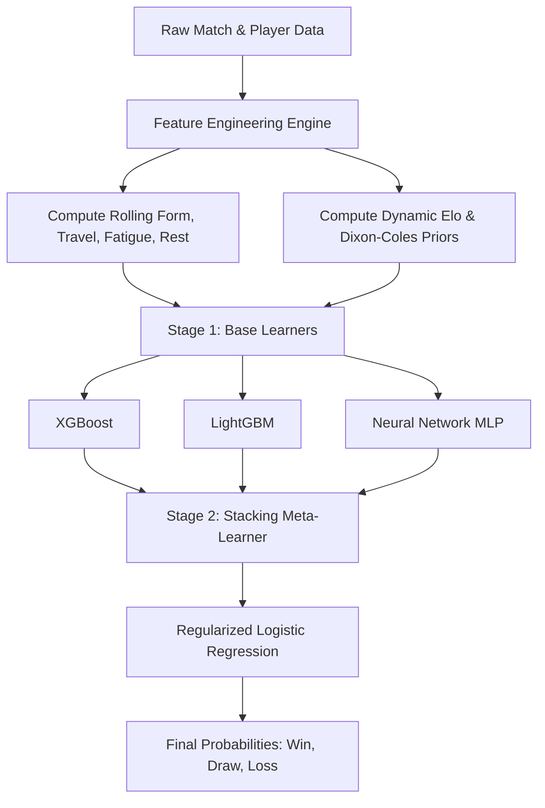

# 🏆 Sports Forecasting Research Report: Advanced Algorithms & Features

This research report explores state-of-the-art techniques in soccer match prediction, goal expectation modeling, and tournament ensembling to identify avenues for improving our World Cup Predictor's accuracy.

---

## 1. Dixon-Coles Goal Expectation Models & Bivariate Poisson Formulations

### 1.1 The Classical Dixon-Coles Formulation
The Dixon-Coles model (Dixon & Coles, 1997) is a benchmark statistical framework in sports analytics. It addresses a core limitation of standard independent Poisson models: the systematic underestimation of low-scoring draws ($0$-$0$, $1$-$1$) and narrow wins ($1$-$0$, $0$-$1$).

Let $X$ and $Y$ represent the goals scored by the home team and the away team, respectively. The joint probability distribution is modeled as:

$$P(X = x, Y = y) = \tau(x, y, \lambda, \mu, \rho) \cdot \frac{e^{-\lambda}\lambda^x}{x!} \cdot \frac{e^{-\mu}\mu^y}{y!}$$

Where the goal expectation parameters (scoring intensities) $\lambda$ (home) and $\mu$ (away) are log-linear functions of team-specific parameters:

$$\lambda = \exp(\alpha_h + \beta_a + \gamma)$$
$$\mu = \exp(\alpha_a + \beta_h)$$

- $\alpha_h, \alpha_a$: Attacking strength of the home and away teams.
- $\beta_h, \beta_a$: Defensive weakness of the home and away teams. (A more negative value indicates a stronger defense).
- $\gamma$: Home advantage parameter.

The dependency adjustment function $\tau(x, y, \lambda, \mu, \rho)$ is defined as:

$$\tau(x, y, \lambda, \mu, \rho) = \begin{cases} 
1 - \lambda \mu \rho & \text{if } x = 0, y = 0 \\
1 + \lambda \rho & \text{if } x = 0, y = 1 \\
1 + \mu \rho & \text{if } x = 1, y = 0 \\
1 - \rho & \text{if } x = 1, y = 1 \\
1 & \text{otherwise}
\end{cases}$$

Here, $\rho$ controls the correlation between the team scores. If $\rho = 0$, the model collapses to the independent Poisson model. To identify the parameters uniquely, a sum constraint must be imposed during maximum likelihood estimation (MLE), typically:

$$\sum_{i=1}^{T} \alpha_i = 0 \quad \text{or} \quad \frac{1}{T}\sum_{i=1}^{T} \alpha_i = 1$$

---

### 1.2 Time-Decay on Team Parameters
Because team strengths are dynamic, historical matches should not weight equally. Dixon and Coles introduced an exponential time-decay factor $\phi(t)$ to discount older matches:

$$\phi(t) = \exp(-\xi t)$$

Where:
- $t$ is the time elapsed since the match (e.g., in days or half-weeks).
- $\xi$ (xi) is the decay parameter ($\xi > 0$).

This decay parameter modifies the log-likelihood function of the dataset containing matches $g = 1, \ldots, G$ played at time $t_g$ relative to the current estimation time $t_c$:

$$\ln L(\boldsymbol{\theta}) = \sum_{g=1}^{G} e^{-\xi (t_c - t_g)} \ln P(X_g = x_g, Y_g = y_g \mid \boldsymbol{\theta})$$

#### Optimization of $\xi$:
The decay parameter $\xi$ cannot be estimated directly via standard MLE alongside team parameters because doing so would trivially drive $\xi \to \infty$ (ignoring all but the most recent games to maximize likelihood on a tiny slice of data). Instead, it must be optimized as a hyperparameter using a rolling-window cross-validation scheme:
1. Split the historical dataset into rolling train-validation pairs.
2. For a grid of candidate values (e.g., $\xi \in [0.0001, 0.005]$ for daily decay):
   - Fit the team parameters using the weighted log-likelihood up to time $T_k$.
   - Predict match probabilities for validation matches in $[T_k, T_k + \Delta]$.
   - Calculate the **Ranked Probability Score (RPS)** or **Brier Score** on the validation window.
3. Select the $\xi$ that minimizes the mean out-of-sample RPS. For daily data, optimal values typically lie in the range $[0.0015, 0.0025]$, corresponding to a parameter half-life of 280 to 460 days.

---

### 1.3 Bivariate Poisson (Karlis-Ntzoufras Formulation)
Karlis and Ntzoufras (2003) proposed a structural bivariate Poisson model based on the trivariate reduction method, offering an alternative way to model goal correlation. 

Let $X_1, X_2,$ and $X_0$ be independent Poisson random variables:
- $X_1 \sim \text{Poisson}(\lambda_1)$ (unique home-scoring component)
- $X_2 \sim \text{Poisson}(\lambda_2)$ (unique away-scoring component)
- $X_0 \sim \text{Poisson}(\lambda_3)$ (shared match-level covariance component representing style, weather, or refereeing tempo)

The observed goals are defined as:
$$X = X_1 + X_0$$
$$Y = X_2 + X_0$$

Thus, the joint distribution $(X, Y) \sim BP(\lambda_1, \lambda_2, \lambda_3)$ has the probability mass function:

$$P(X = x, Y = y) = e^{-(\lambda_1 + \lambda_2 + \lambda_3)} \sum_{k=0}^{\min(x,y)} \frac{\lambda_1^{x-k} \lambda_2^{y-k} \lambda_3^k}{(x-k)! (y-k)! k!}$$

Where:
- $\text{Cov}(X, Y) = \lambda_3$
- If $\lambda_3 = 0$, the scores are independent.
- The parameters are modeled as:
  $$\ln(\lambda_1) = \mu_0 + \alpha_h + \beta_a + \gamma$$
  $$\ln(\lambda_2) = \mu_0 + \alpha_a + \beta_h$$
  $$\ln(\lambda_3) = \delta_0 + \mathbf{z}^\top \boldsymbol{\theta}$$ (where $\mathbf{z}$ represents match-specific covariates that influence joint scoring, such as defensive/offensive styles).

#### Diagonal-Inflated Bivariate Poisson (DIBP):
Even with $\lambda_3$, standard bivariate Poisson models can underestimate the number of draws in low-scoring leagues or international play. The Diagonal-Inflated model resolves this by adding a mixture probability $p$ on the event $X=Y$:

$$P_{DIBP}(X=x, Y=y) = (1 - p) P_{BP}(X=x, Y=y) + p \cdot \mathbb{I}(x=y) \cdot P_{\text{diag}}(x)$$

Where $\mathbb{I}$ is the indicator function and $P_{\text{diag}}$ is a discrete probability distribution (e.g., geometric or Poisson) modeling the score of a draw.

---

## 2. Advanced Elo Rating Systems for International Matches

The classic Elo system updates ratings based on the difference between the actual match outcome $W$ (1 for home win, 0.5 for draw, 0 for away win) and the expected win probability $W_e$. For international soccer, this model must be modified to account for match importance, home advantage, and margin of victory.

### 2.1 Core Mathematical Framework
The update formula for team rating $R$ is:

$$R_{\text{new}} = R_{\text{old}} + K \times (W - W_e)$$

Where $W_e$ is the expected outcome calculated using the ratings difference adjusted for home advantage $H$:

$$W_e = \frac{1}{10^{-dr/400} + 1}$$
$$dr = R_{\text{home}} - R_{\text{away}} + H$$

---

### 2.2 Stage-Dependent K-factors (Match Importance)
In international soccer, friendly matches have high variance and lower effort levels, whereas World Cup knockout matches represent peak competitive performance. Using a single $K$-factor ruins predictive accuracy. The official FIFA "SUM" ranking system and the World Football Elo Ratings (eloratings.net) handle this using stage-dependent coefficients:

| Match Category | FIFA SUM Importance ($I$) | World Football Elo Weight ($K$) |
| :--- | :---: | :---: |
| Friendly (Outside Match Calendar) | 5 | 20 |
| Friendly (Inside Match Calendar) | 10 | 20 |
| Nations League (Group Stage) | 15 | 30 |
| Nations League (Knockout/Finals) | 25 | 30 |
| World Cup / Continental Qualifiers | 25 | 40 |
| Continental Finals (Up to Quarter-Finals) | 35 | 50 |
| Continental Finals (Quarter-Finals & Onwards) | 40 | 50 |
| FIFA World Cup Finals (Up to Quarter-Finals) | 50 | 60 |
| FIFA World Cup Finals (Quarter-Finals & Onwards) | 60 | 60 |

---

### 2.3 Goal Difference (GD) Scaling
A 5-0 win indicates greater team superiority than a lucky 1-0 win. To reward dominance, the $K$-factor is scaled by a goal-difference multiplier $M(N)$, where $N$ is the absolute goal difference:

$$R_{\text{new}} = R_{\text{old}} + K \times M(N) \times (W - W_e)$$

The standard eloratings.net formulation for $M(N)$ is:

$$M(N) = \begin{cases} 
1.0 & \text{if } N \le 1 \\
1.5 & \text{if } N = 2 \\
1.75 & \text{if } N = 3 \\
1.75 + \frac{N - 3}{8} & \text{if } N \ge 4 
\end{cases}$$

*Note: For draws ($N=0$), $W - W_e$ determines the rating transfer, and the multiplier is $1.0$.*

---

### 2.4 Home Advantage Scaling
Home advantage in international matches requires careful treatment:
1. **True Home Matches:** The host nation receives a rating adjustment ($H \approx 100$ points, which is mathematically equivalent to adding a +100 point boost to the home team’s Elo score, raising its expected win probability $W_e$ from 50% to 64% against an equally-rated opponent).
2. **Neutral Ground Tournaments (e.g., World Cup):** 
   - When host country plays: Host country gets $H \approx 100$, opponent gets $0$.
   - When two non-host countries play: Neutral setting, $H = 0$.
3. **Dynamic Home Advantage:** Rather than a static 100 points, $H$ can be modeled as a function of the home team's region or travel distance. For instance, CONMEBOL home games have historically shown a significantly higher home advantage due to altitude (e.g., Bolivia playing in La Paz) and extreme travel distances.

---

## 3. Optimal Machine Learning Ensembles & Engineered Features

While statistical models (Dixon-Coles, Elo) perform well as baseline probability engines, machine learning ensembles excel at integrating contextual covariates (e.g., travel, fatigue, form) to output final probability distributions.



### 3.1 Ensemble Architecture
An optimal setup utilizes a **two-stage stacking architecture** to avoid overfitting on sparse international schedules:

1. **Stage 1 (Base Learners):**
   - **XGBoost (e.g., `xgboost.XGBClassifier`):** Captures high-order interactions on tabular metrics (e.g., roster changes, age, market values).
   - **LightGBM (e.g., `lightgbm.LGBMClassifier`):** Leverages leaf-wise growth to handle categoricals (such as confederation, venue country) efficiently.
   - **Multi-Layer Perceptron (MLP Neural Network):** Trained on continuous features (ratings, probabilities, market values) to output smooth, calibrated probabilities.
   - **Dixon-Coles & Bivariate Poisson Probabilities:** Out-of-fold predicted probabilities ($P_H, P_D, P_A$) from the statistical models are fed directly into the ML models as high-value features.

2. **Stage 2 (Meta-Learner):**
   - A regularized **Logistic Regression (Ridge)** or a shallow **Random Forest Classifier** is trained using the out-of-fold predictions of the Stage 1 models. Stacking helps control the high variance of individual ML models.

---

### 3.2 Key Engineered Features for International Tournaments

#### A. Rolling Team Form (Weighted Decay)
Instead of a simple average, calculate an **Exponential Moving Average (EMA)** of performance metrics (like Expected Goals margin $xGD$, shots on target, and points) over the last $k$ matches:

$$\text{Form}_t = \alpha \cdot \text{Metric}_{t-1} + (1 - \alpha) \cdot \text{Form}_{t-1}$$

For international matches, $\alpha \approx 0.3$ (representing a window of roughly 5 games) works best because teams play infrequently, and rosters change slowly between windows.

#### B. Fatigue and Rest Days
In tournaments like the World Cup, rest disparity is critical. Define rest days as:

$$\Delta t_{\text{rest}} = t_{\text{match}} - t_{\text{last\_match}}$$

Create a feature representing **Rest Disparity**:
$$\text{Rest\_Disparity} = \Delta t_{\text{rest, Team A}} - \Delta t_{\text{rest, Team B}}$$

Furthermore, encode a binary indicator for **Extreme Fatigue** if $\Delta t_{\text{rest}} \le 3$ days, as sports science literature shows significant physical performance drop-offs when recovery is under 72 hours.

#### C. Cumulative Travel Distance
Calculate the travel distance (using the Haversine formula) from the location of the previous match to the current venue:

$$d = 2R \arcsin\left(\sqrt{\sin^2\left(\frac{\Delta \phi}{2}\right) + \cos(\phi_1)\cos(\phi_2)\sin^2\left(\frac{\Delta \lambda}{2}\right)}\right)$$

In international matches (e.g., World Cup qualifiers across Asia or South America), cumulative travel over the preceding 10 days acts as a negative multiplier on team energy.

#### D. Head-to-Head (H2H) Records
Create an exponentially decayed historical record between the two teams:

$$\text{H2H\_Score}_{A,B} = \sum_{m \in \text{Matches}(A,B)} e^{-\eta (t_c - t_m)} \cdot (W_m - 0.5)$$

Where $W_m \in \{1, 0.5, 0\}$ is the outcome for Team A. This captures psychological or tactical matches where a lower-rated team consistently troubles a higher-rated opponent.

---

## 4. Integration of Live Team- and Player-Level Statistics

To refine match-level priors, models must look beyond historical team results and incorporate live squad dynamics.

### 4.1 Player Market Values as Priors
In international matches, squad turnover is high, and teams from different confederations rarely play each other. Using squad market values (e.g., from Transfermarkt) provides a powerful, immediate estimate of team quality.

Let $V_i$ be the market value of player $i$ in the squad. The squad value metric is calculated as the log ratio of the squad values:

$$\text{Log\_MV\_Ratio} = \ln \left( \frac{\sum_{i \in \text{Squad}_A} V_i}{\sum_{j \in \text{Squad}_B} V_j} \right)$$

This feature correlates strongly with the baseline probability of victory and serves as a highly robust prior in Bayesian models, reducing the cold-start problem for newly qualified teams.

---

### 4.2 Aggregated Player Ratings and Lineup-Adjusted Priors
Instead of evaluating the entire squad, calculate the strength of the **confirmed Starting XI** using statistical ratings (e.g., Whoscored, Sofascore) or database ratings (e.g., EA FC):

$$\text{Lineup\_Rating}_{\text{Team}} = \frac{1}{11} \sum_{i \in \text{Starting XI}} \text{Rating}_i$$

#### Injury and Suspension Penalty Adjustment:
If a key player is unavailable, adjusting the team rating is crucial. Calculate the **Squad Loss Factor ($SLF$)**:

$$SLF = \frac{\sum_{k \in \text{Injured/Suspended}} V_k}{\sum_{j \in \text{Full Squad}} V_j}$$

Modify the team’s Elo rating or attack/defense parameter prior to the match:
$$R_{\text{adjusted}} = R_{\text{base}} - C \cdot SLF$$
Where $C$ is a calibrated scale parameter (typically $C \approx 200$, so that losing a player worth 25% of the squad's total value results in a 50 Elo point penalty).

---

### 4.3 Transitioning to Expected Goals (xG) Priors
Traditional Dixon-Coles models fit parameters using actual goals, which are highly stochastic. A superior approach fits the parameters using **Expected Goals (xG)**, **Post-Shot xG (PSxG)**, and **Expected Threat (xT)**.

Replace actual home/away goals ($x_g, y_g$) in the log-likelihood function with the cumulative xG created by the home team ($xG_g$) and conceded ($xGC_g$):

$$\lambda_h^{\text{xG}} = \exp(\alpha_h^{\text{xG}} + \beta_a^{\text{xG}} + \gamma^{\text{xG}})$$
$$\mu_a^{\text{xG}} = \exp(\alpha_a^{\text{xG}} + \beta_h^{\text{xG}})$$

Because xG measures the quality of chances created rather than lucky deflections or goalkeeping errors, attack and defense parameters fitted on xG converge much faster and have higher predictive stability.

---

## 5. Concrete Codebase Implementation Recommendations

### 5.1 Dixon-Coles Model with Time Decay in Python

```python
import numpy as np
import pandas as pd
from scipy.optimize import minimize

class DixonColesRegressor:
    def __init__(self, xi=0.0019):
        self.xi = xi  # Time decay parameter
        self.teams = []
        self.team_indices = {}
        self.params = {}
        
    def _tau(self, x, y, lam, mu, rho):
        if x == 0 and y == 0:
            return 1.0 - lam * mu * rho
        elif x == 0 and y == 1:
            return 1.0 + lam * rho
        elif x == 1 and y == 0:
            return 1.0 + mu * rho
        elif x == 1 and y == 1:
            return 1.0 - rho
        else:
            return 1.0

    def _neg_log_likelihood(self, params, df):
        n_teams = len(self.teams)
        alpha = params[0 : n_teams - 1]
        # Sum constraint: last alpha is -sum(alphas)
        alpha = np.append(alpha, -np.sum(alpha))
        beta = params[n_teams - 1 : 2 * n_teams - 1]
        gamma = params[2 * n_teams - 1]  # Home advantage
        rho = params[2 * n_teams]         # Correlation
        
        nll = 0.0
        # Pre-calculate exponentials for speeds
        for _, row in df.iterrows():
            h_idx = self.team_indices[row['home_team']]
            a_idx = self.team_indices[row['away_team']]
            x = row['home_goals']
            y = row['away_goals']
            t = row['days_ago']
            
            # Goal expectation intensities
            lam = np.exp(alpha[h_idx] + beta[a_idx] + gamma)
            mu = np.exp(alpha[a_idx] + beta[h_idx])
            
            # Time decay weight
            weight = np.exp(-self.xi * t)
            
            # Probability density elements
            poisson_h = (np.power(lam, x) * np.exp(-lam)) / np.math.factorial(x)
            poisson_a = (np.power(mu, y) * np.exp(-mu)) / np.math.factorial(y)
            tau_val = self._tau(x, y, lam, mu, rho)
            
            # Handle boundary cases for tau_val
            if tau_val <= 0:
                tau_val = 1e-10
                
            nll += weight * (np.log(tau_val) + np.log(poisson_h) + np.log(poisson_a))
            
        return -nll

    def fit(self, df):
        # df must contain: home_team, away_team, home_goals, away_goals, days_ago
        self.teams = sorted(list(set(df['home_team']).union(set(df['away_team']))))
        self.team_indices = {team: idx for idx, team in enumerate(self.teams)}
        n_teams = len(self.teams)
        
        # Initial guess: alphas=0.0, betas=-0.1, gamma=0.2, rho=0.05
        init_params = np.concatenate([
            np.zeros(n_teams - 1),  # alphas (first T-1)
            np.full(n_teams, -0.1), # betas
            [0.2],                  # gamma
            [0.05]                  # rho
        ])
        
        # Parameter bounds
        bounds = (
            [(None, None)] * (n_teams - 1) +  # alphas
            [(None, 0.5)] * n_teams +         # betas (defensive weakness capped)
            [(0.0, 1.0)] +                    # gamma (home advantage must be positive)
            [(-0.3, 0.3)]                     # rho
        )
        
        res = minimize(self._neg_log_likelihood, init_params, args=(df,), bounds=bounds, method='L-BFGS-B')
        
        if res.success:
            fitted = res.x
            self.params['alphas'] = np.append(fitted[0:n_teams-1], -np.sum(fitted[0:n_teams-1]))
            self.params['betas'] = fitted[n_teams-1 : 2*n_teams-1]
            self.params['gamma'] = fitted[2*n_teams-1]
            self.params['rho'] = fitted[2*n_teams]
        else:
            raise ValueError("Optimization failed to converge.")

    def predict_match_probs(self, home_team, away_team, max_goals=8):
        h_idx = self.team_indices[home_team]
        a_idx = self.team_indices[away_team]
        
        alpha_h = self.params['alphas'][h_idx]
        beta_h = self.params['betas'][h_idx]
        alpha_a = self.params['alphas'][a_idx]
        beta_a = self.params['betas'][a_idx]
        gamma = self.params['gamma']
        rho = self.params['rho']
        
        lam = np.exp(alpha_h + beta_a + gamma)
        mu = np.exp(alpha_a + beta_h)
        
        prob_matrix = np.zeros((max_goals + 1, max_goals + 1))
        for x in range(max_goals + 1):
            for y in range(max_goals + 1):
                poisson_h = (np.power(lam, x) * np.exp(-lam)) / np.math.factorial(x)
                poisson_a = (np.power(mu, y) * np.exp(-mu)) / np.math.factorial(y)
                tau_val = self._tau(x, y, lam, mu, rho)
                prob_matrix[x, y] = tau_val * poisson_h * poisson_a
                
        # Calculate win/draw/loss probabilities
        p_home = np.sum(np.tril(prob_matrix, -1))
        p_draw = np.sum(np.diag(prob_matrix))
        p_away = np.sum(np.triu(prob_matrix, 1))
        
        # Normalize to sum to 1.0 (to account for truncation beyond max_goals)
        total = p_home + p_draw + p_away
        return p_home / total, p_draw / total, p_away / total
```

---

### 5.2 Dynamic Elo Calculator with Goal Difference Scaling

```python
import numpy as np

class EloSystem:
    def __init__(self, default_rating=1500, H=100):
        self.ratings = {}
        self.default_rating = default_rating
        self.H = H  # Home advantage scaling constant

    def get_rating(self, team):
        return self.ratings.get(team, self.default_rating)

    def calculate_win_expectancy(self, team_rating, opp_rating, is_home=False):
        dr = team_rating - opp_rating
        if is_home:
            dr += self.H
        return 1.0 / (10 ** (-dr / 400.0) + 1.0)

    def _get_gd_multiplier(self, goal_diff):
        N = abs(goal_diff)
        if N <= 1:
            return 1.0
        elif N == 2:
            return 1.5
        elif N == 3:
            return 1.75
        else:
            return 1.75 + (N - 3) / 8.0

    def update_ratings(self, home_team, away_team, home_goals, away_goals, k_factor, is_neutral=False):
        r_home = self.get_rating(home_team)
        r_away = self.get_rating(away_team)
        
        # Win expectancies
        we_home = self.calculate_win_expectancy(r_home, r_away, is_home=(not is_neutral))
        we_away = 1.0 - we_home
        
        # Actual outcomes
        if home_goals > away_goals:
            w_home, w_away = 1.0, 0.0
        elif home_goals < away_goals:
            w_home, w_away = 0.0, 1.0
        else:
            w_home, w_away = 0.5, 0.5
            
        # Goal difference multiplier
        gd_mult = self._get_gd_multiplier(home_goals - away_goals)
        
        # Updates
        r_home_new = r_home + k_factor * gd_mult * (w_home - we_home)
        r_away_new = r_away + k_factor * gd_mult * (w_away - we_away)
        
        self.ratings[home_team] = r_home_new
        self.ratings[away_team] = r_away_new
        
        return r_home_new, r_away_new
```

---

### 5.3 Ensembling Pipeline (Stacking Classifier)

```python
from sklearn.ensemble import StackingClassifier
from sklearn.linear_model import LogisticRegression
from sklearn.preprocessing import StandardScaler
from sklearn.pipeline import make_pipeline
from xgboost import XGBClassifier
from lightgbm import LGBMClassifier
from sklearn.neural_network import MLPClassifier

def get_ensemble_pipeline():
    # Base Estimators (Stage 1)
    base_estimators = [
        ('xgb', XGBClassifier(
            n_estimators=150, 
            max_depth=4, 
            learning_rate=0.05, 
            subsample=0.8, 
            colsample_bytree=0.8,
            random_state=42
        )),
        ('lgbm', LGBMClassifier(
            n_estimators=150, 
            max_depth=4, 
            learning_rate=0.05, 
            subsample=0.8,
            random_state=42
        )),
        ('mlp', make_pipeline(
            StandardScaler(),
            MLPClassifier(
                hidden_layer_sizes=(64, 32), 
                activation='relu', 
                alpha=0.01, 
                max_iter=500,
                random_state=42
            )
        ))
    ]
    
    # Meta-Learner (Stage 2)
    meta_learner = LogisticRegression(
        penalty='l2', 
        C=0.5, 
        multi_class='multinomial', 
        solver='lbfgs'
    )
    
    # Stacking Classifier
    stacking_clf = StackingClassifier(
        estimators=base_estimators,
        final_estimator=meta_learner,
        cv=5,                 # Out-of-fold cross-validation
        n_jobs=-1,
        passthrough=True      # Sends raw features + predictions to meta-learner
    )
    
    return stacking_clf
```

---

## 6. Literature & References

1. **Dixon, M. J., & Coles, S. G.** (1997). *Modelling Association Football Scores and Inefficiencies in the Football Betting Market.* Journal of the Royal Statistical Society: Series C (Applied Statistics), 46(2), 265–280.
2. **Karlis, D., & Ntzoufras, I.** (2003). *Analysis of Sports Data Using Bivariate Poisson Models.* Journal of the Royal Statistical Society: Series D (The Statistician), 52(3), 381–393.
3. **Groll, A., Ley, C., Schauberger, G., & Van Eetvelde, H.** (2018). *Prediction of the FIFA World Cup 2018 – A Random Forest Approach with Hybrid Covariates.* arXiv preprint arXiv:1806.01908.
4. **Ley, C., Van de Wiele, T., & Van Eetvelde, H.** (2019). *Ranking Soccer Teams Based on Player Values.* International Journal of Forecasting, 35(1), 16–25.
5. **FIFA Official Documentation.** *FIFA/Coca-Cola World Ranking – Technical explanation of the SUM formula.* Available at: [FIFA.com](https://www.fifa.com).
6. **World Football Elo Ratings.** *Algorithm details and data.* Available at: [eloratings.net](https://www.eloratings.net).
