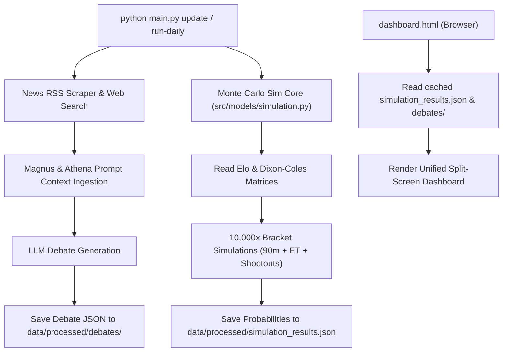

# Phase 4 Spec: Active News Debates & Monte Carlo Simulation Dashboard

This specification defines the design and architecture for Phase 4 of the 2026 FIFA World Cup Predictor & Parlay Engine.

---

## 1. Objectives

1. **Active News Debating Agents**: Equip Magnus and Athena with the ability to retrieve real-time squad roster changes, injuries, and tournament news before debating and placing paper trades, saving these debates as HTML/JSON reports in a unified dashboard.
2. **Tournament Monte Carlo Simulation Dashboard**: Build a Python-based 10,000x tournament simulation engine running on match/elo updates, rendering a beautiful responsive split-screen dashboard to view the bracket progression probabilities.

---

## 2. System Architecture & Components



### Component A: Active News Debating
* **File Location**: `src/market/llm.py`
* **Workflow**:
  1. For any queried match, check if news sentiment or updates are available via RSS feeds. If missing, perform a targeted query using our web search capabilities (e.g. `"<Team> national football team news roster injuries 2026"`).
  2. Parse the top articles into a concise bullet-point news summary context block.
  3. Inject the news summary context into both `magnus_prompt` and `athena_prompt` to debate.
  4. Write the final debate log to `data/processed/debates/YYYY-MM-DD-<home>-vs-<away>.json`.

### Component B: Monte Carlo Simulation Engine
* **File Location**: `src/models/simulation.py`
* **Inputs**:
  - Live ELO ratings from `data/processed/elo_ratings.json`.
  - Dixon-Coles parameters from `src/models/trainer.py` or statistical models.
  - Bracket definition (e.g. Round of 16, Quarters, Semis, Finals).
* **Execution (10,000 Runs)**:
  - For each match in the bracket:
    1. Calculate 90m scoreline probability matrix using Dixon-Coles.
    2. If Draw, simulate extra time (30m) using scaled Dixon-Coles rates.
    3. If still Draw, simulate penalty shootout using goalie saving rates (from `src/predictor.py` goalkeeper profiles).
  - Track each team's progress to: Quarterfinals, Semifinals, Finals, and Champions.
  - Aggregate statistics and save to `data/processed/simulation_results.json`.

### Component C: Web Dashboard
* **File Location**: `dashboard.html` (in project root)
* **Design system**: Modern, premium look with dark-mode styling (tokyo-night theme), responsive split-view layout.
  - **Left Pane (Interactive Bracket)**: Shows the current knockout bracket stage. Hovering over a match shows head-to-head records and ELO comparisons.
  - **Right Pane (Simulation Table)**: Shows a sortable list of teams, their Elo, and their probability of reaching subsequent rounds (visualized with clean percentage progress bars).
  - **Bottom Pane (Debate Logs)**: Integrates debates. If a debate file exists for a match in the bracket, clicking it reveals a sleek overlay containing the Magnus vs Athena scout-quant transcript.

---

## 3. Data Schema Definitions

### `simulation_results.json`
```json
{
  "last_updated": "2026-07-05T05:00:00Z",
  "tournament_stage": "Quarterfinals",
  "probabilities": [
    {
      "team": "France",
      "elo": 2105.0,
      "reach_qf": 1.0,
      "reach_sf": 0.685,
      "reach_final": 0.421,
      "champion": 0.245
    }
  ],
  "bracket": {
    "QF1": { "home": "France", "away": "Sweden", "scheduled_date": "2026-07-05" }
  }
}
```

---

## 4. Test & Verification Plan

1. **Unit Testing**:
   - `scratch/test_news_debates.py`: Mock the RSS/search results, verify they are properly injected into the debate prompts, and check that debate JSON outputs are written successfully.
   - `scratch/test_monte_carlo.py`: Run a mini 100-run simulation of the bracket, assert that probabilities sum to 100% per bracket node, and check that output matches the schema.
2. **Dashboard Ingestion Verification**:
   - Open the web dashboard, verify it loads correctly from the cached JSONs without errors.
